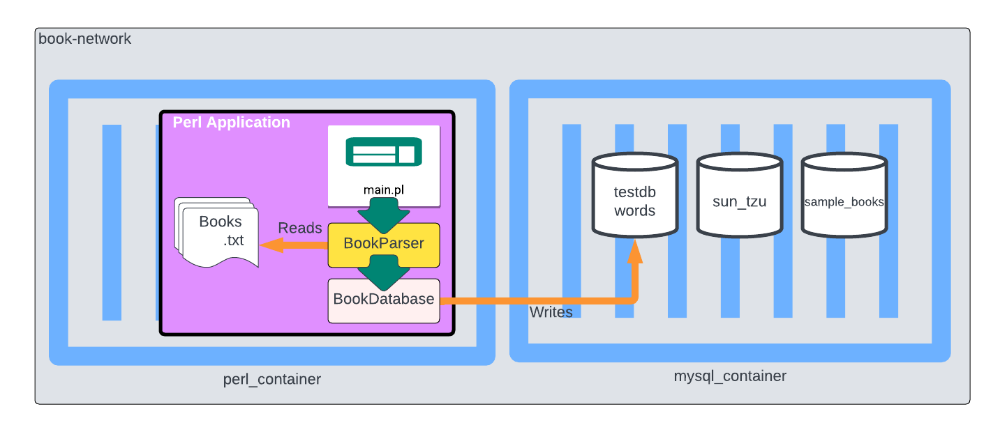

# Rescuing old code written in perl.

## Prerequisite

You need to have Docker installed.

## Setup

Containerized perl app and MySQL database:




- Launch orchestrator: `docker-compose up`


## Relaunch perl container

If you need to run the imports again, but do not want to fully rebuild the databases, just relaunch the perl container with the following script: `$sh rerun.sh`

## Books and Words

This is a project developped using perl in 2009.

It reads books in text format (As can be found for example in Project Gutemberg - https://www.gutenberg.org/), parses sentences and stores them in a mysql database. The format used in the relational databases is designed to query for sentences containing specific words. It is also handy to examine word frequency in different books.

## Sample Databases

A few sql scripts have been provided. Feel free to run them in the command line to see sentences extracted from our book databases.

- known sources in sample_books: 

```
mysql> SELECT source FROM sentences GROUP BY source;

+----------------+
| source         |
+----------------+
| atest.txt      |
| es_quijote.txt |
| en_quijote.txt |
| alice_EN.txt   |
| alice_FR.txt   |
+----------------+
```

- known sources in sun_tzu: 


```
mysql> SELECT source FROM words GROUP BY source;`

+------------------------------+
| source                       |
+------------------------------+
| sun_tzu_art_de_la_guerre.txt |
+------------------------------+
```

## Book Parser

* V1 is now seriously refactored. *
`main.pl` will search for all .txt files witin a directory and import them.

### Read through a large file

Now performed within the perl container script.